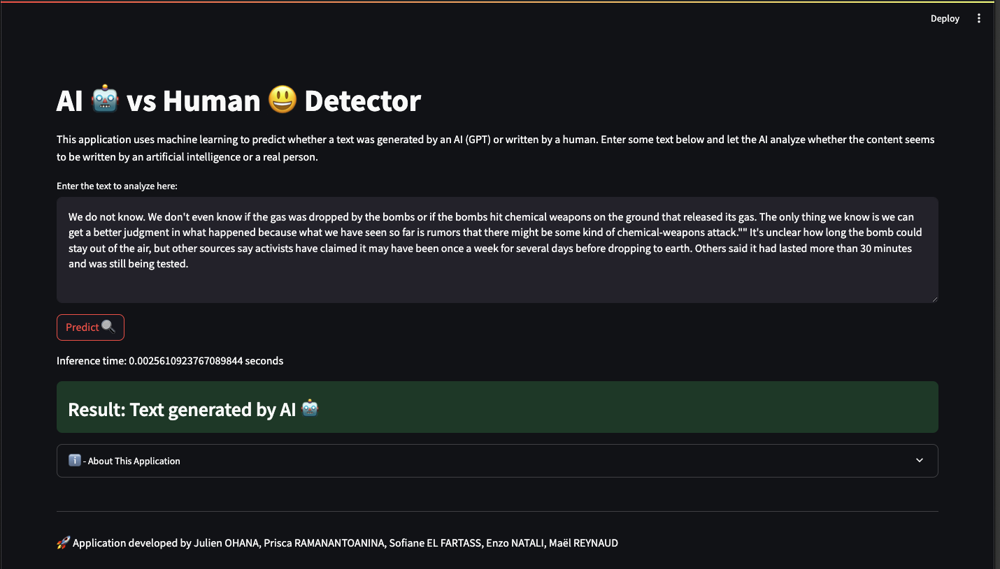

# IA-DATA-HACK



This project contains our solution to the **AI vs IA** challenge of the **IA-DATA-HACK** hackathon.<br><br>
To run our solution, you need to execute the following commands in a terminal:

```shell
foo@bar:~$ python -m venv env
foo@bar:~$ source env/bin/activate
(env) foo@bar:~$ pip install -r requirements.txt
foo@bar:~$ python make_final_model.py
foo@bar:~$ streamlit run app/app.py 
```

Once you have installed the dependencies, you can run the notebook by selecting the Python environment you just created, and that's it!